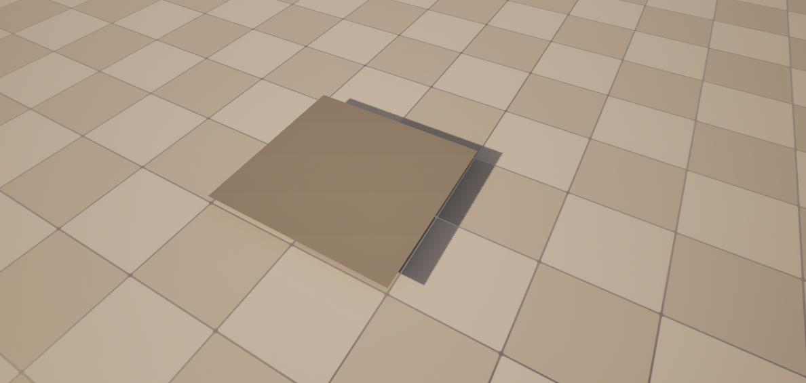

Jonas Mahler 12.2024

# Description
This plugin is developed with assimp 5.4.3, Unreal 5.3 and Windows 10.  

It handles dynamic mesh spawning in Unreal Engine using Assimp  
as an external dependency. Assimp2UnrealExample only contains a very  
simple example of how to read an external mesh file with Assimp and   
spawn it in the world with the Procedural Mesh Component. It does not   
cover recursive node reading, nor any other features of Assimp above  
reading the vertices and triangles from the mesh. Instead, it may serve  
as an entry point on how to use Assimp in a plugin and make it  
compatible with Unreal.

Rading and spawning the example mesh in the Content folder of the plugin looks as follows:

{width=250}

# Build the plugin

Create a new project in Unreal Engine and add the plugin to it.       

Add the plugin by copying the code into a directory called ```Plugins``` in the root   
directory of Unreal Engine. Also locate the ```ProjectName.Build.cs``` file    
in``` ProjectName/Source/ProjectName``` and add the plugin to the following line e.g.      
```PublicDependencyModuleNames.AddRange(new string[] { "Core", "CoreUObject", "Engine", "InputCore", "Assimp2UnrealExample" }); ```      

Delete the ```Intermediate``` folder in the projects root directory and right click   
UnrealEngineProjectFile in the same directory. Hit ```Generate Visual Studio Project Files```.   
Thereafter build the project either by opening the editor by double click on the       
UnrealEngineProjectFile or in visual studio code.      

# Run the plugin
Open the projects editor and locate the ```MyActor.cpp``` file in the  
projects plugin directory. Drag and drop the file into the world.     

If you are not able to see the mesh and receive a failed message,  
first check if the right path to the mesh file is set. 